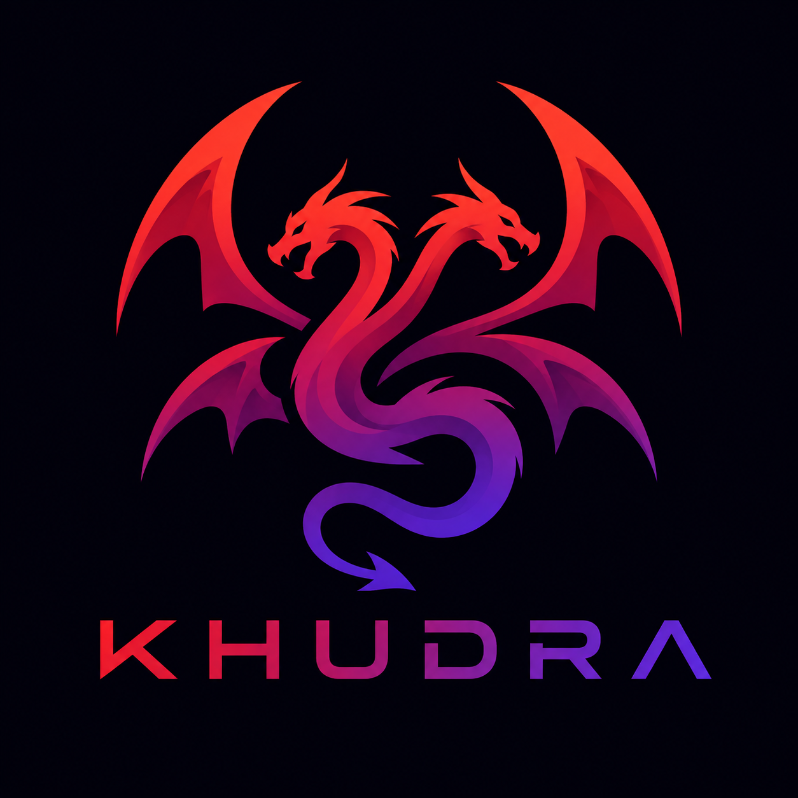

<p align="center">
  
</p>

# Khudra

An object-oriented language with a hand-written compiler and a bytecode VM.

Khudra expands on OOP in three directions:

1. **Full OOP** -- classes, fields, methods, constructors, vtable dispatch.
2. **Memory management chosen through an object** -- a class picks garbage
   collection or manual allocation with a `MemoryAllocationTypeObject` field,
   and an allocation site can override it.
3. **Procedures** -- a named block in a class body that runs the moment an
   instance is loaded into memory, instead of waiting to be called.

```khudra
bring khu::stdlib;

public class Session {
    public MemoryAllocationTypeObject type = MemoryAllocationTypeObject.setStandard();

    public int32 id = 0;

    // Runs during materialization, before the constructor body and before the
    // allocation site resumes.
    private Procedures(int32 handle) {
        io.print("session ");
        io.print(handle);
        io.printLine(" loaded");
    }

    public Session(int32 handle) {
        this.id = handle;
    }

    func main() {
        Session s = Session(7);
        io.printLine(s.id);
    }
}
```

## Building

```
cmake -S . -B build
cmake --build build
ctest --test-dir build
```

Add `-DKHU_SANITIZE=ON` to build the whole tree under AddressSanitizer and
UndefinedBehaviorSanitizer.

## Using the toolchain

```
khudra check   file.khu      parse and typecheck
khudra run     file.khu      compile in memory and execute
khudra compile file.khu      write a .kbc bytecode image
khudra disasm  file.khu      print a bytecode listing
khudra run     file.kbc      execute a compiled image
khudra run     file.khu -- a b c    run it with arguments
```

`--dump-tokens` and `--dump-ast` print the intermediate forms. Everything after
a `--` belongs to the program rather than to khudra, and is what
`khuStdSystem.argv()` answers with.

### Native execution

The same program can run without an interpreter at all. `--native` compiles the
image to native code and runs it against raw memory; `build` writes a
standalone executable that needs neither `khudra` nor a VM to run.

```
khudra run --native file.khu      compile to native code and run it in process
khudra build file.khu -o prog     write a standalone native executable
khudra build file.kbc             a compiled image works too
khudra build file.khu --keep-c    keep the intermediate C beside the binary
```

Both need a host C compiler. `run --native` falls back to the bytecode VM with
a printed notice when there is none; `build` reports it, since producing a
native binary is the whole request.

The native backend runs on POSIX hosts and on Windows under MinGW-w64. MSVC is
not supported: it needs a different symbol model, which is the one place the
emitted C would have to change.

Output does not depend on which path you take: stdout, stderr and exit codes are
byte-identical across the VM and both native modes, and `ctest` checks that for
every program in `examples/` and `tests/integration/`. See
[`docs/native.md`](docs/native.md).

### Talking to the system

`khuStdSystem` is the part of the standard library that reaches outside the
heap: files, the process, the file namespace, and blocking TCP sockets.

```khudra
*byte listener = khuStdSystem.listen("127.0.0.1", 8080);
*byte connection = khuStdSystem.accept(listener);
khuStdSystem.recv(connection, buffer, 2048);
```

Every member behaves the same way on Linux and on Windows: the file layer is C
`stdio`, paths are built out of `khuStdSystem.pathSeparator()`, and everything
platform-shaped lives in one file (`src/vm/platform.cpp`) rather than being
spread through the natives. `examples/http_server.khu` is a real HTTP server
that binds its own port; `scripts/test_http_server.sh` drives it with `curl`
under all three backends.

## Layout

| Path | What is there |
|---|---|
| `src/lib/` | the compiler: diagnostics, lexer, parser, sema, codegen, bytecode |
| `src/vm/` | the VM: interpreter, object model, collector, manual arenas |
| `src/native/` | the native backend: the C emitter and the host it runs against |
| `utils/` | the C runtime: the Procedure engine, manual allocation, bool support |
| `lib/` | the standard library, written in Khudra and embedded in the binary |
| `examples/` | sample programs |
| `tests/` | unit tests and golden-file integration tests |
| `docs/` | the specification, memory model, Procedures and bytecode formats |

## Documentation

- [`KHU-PLAN.md`](KHU-PLAN.md) -- the design decisions and the implementation plan
- [`docs/spec.md`](docs/spec.md) -- the language
- [`docs/memory-model.md`](docs/memory-model.md) -- strategies, pinning, the collector
- [`docs/procedures.md`](docs/procedures.md) -- the materialization pipeline
- [`docs/bytecode.md`](docs/bytecode.md) -- the instruction set and the `.kbc` format
- [`docs/native.md`](docs/native.md) -- the native backend: `--native`, `build`, safepoints
